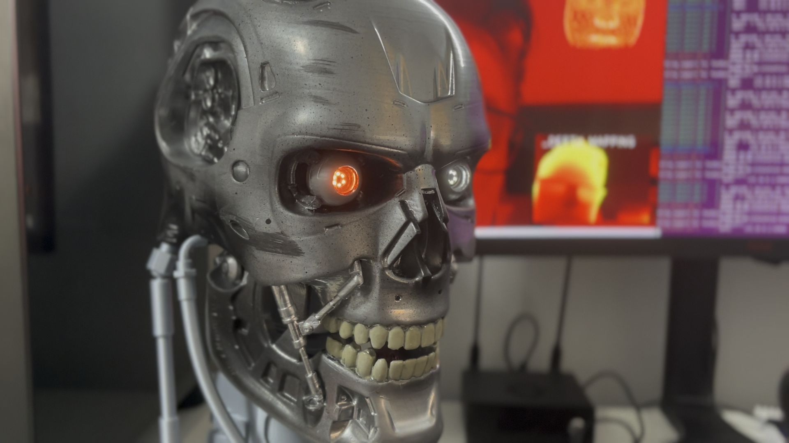

# Terminator Vision Simulation

3D printed T-800 head model


## Overview

This opensource project simulates the iconic "Terminator Vision" from the classic movie *The Terminator*. The simulation replicates the red-tinted HUD (Heads-Up Display) seen through the eyes of the Terminator, object segmentation and track, and face detection.

## Features

- **Red-Tinted HUD**: A distinctive red overlay that mimics the visual style of the Terminator's vision.
- **Object Segmentation and track**: Identifies and highlights objects in real-time.
- **Depht Estimation**: Classifies objects based on threat level, with different color codes.
- **Face Detection**: Draws a mesh over the estimated surface of the detected face.

## Very Important

This project was developed to run on the NVidia Jetson Orin Nano platform!

## Screenshots

HUD Screenshot


Connection failure simulation


## Installation

To get started with the simulation, follow these steps:

1. **Clone the Repository**:
    ```bash
    git clone https://github.com/zmacario/Terminator_T800.git
    cd Terminator_T800
    ```

2. **Install Dependencies**:
    Make sure you have Python 3.8+ installed. Then, run:
    ```bash
    pip install -r requirements.txt
    ```

3. **Run the Simulation**:
    ```bash
    python main.py
    ```

## Usage

Once the simulation is running, you can:

- Move the camera feed to simulate different perspectives.
- Use the `Q` key to exit the simulation.

## Contributing

We welcome contributions to enhance this project! Please submit a pull request or open an issue for any bugs or feature requests.

## License

This project is licensed under the MIT License. See the `LICENSE` file for more details.

## Third-Party Repositories and Licenses

This project makes use of the following third-party repositories:

1. **Ultralytics**
   - Repositório: [Ultralytics](https://github.com/ultralytics/ultralytics)
   - Licença: [AGPL-3.0 license](https://github.com/ultralytics/ultralytics/blob/main/LICENSE)

2. **Google AI Edge**
   - Repositório: [Mediapipe](https://github.com/google-ai-edge/mediapipe)
   - Licença: [Apache License 2.0](https://github.com/google-ai-edge/mediapipe/blob/master/LICENSE)

3. **Depth Anything V2**
   - Repositório: [Depth Anything V2](https://github.com/DepthAnything/Depth-Anything-V2)
   - Licença: [Apache License 2.0](https://github.com/DepthAnything/Depth-Anything-V2/blob/main/LICENSE)


## Acknowledgements

- Inspired by *The Terminator* movie, directed by James Cameron.
- Special thanks to the open-source community for providing the tools and libraries used in this project.

---